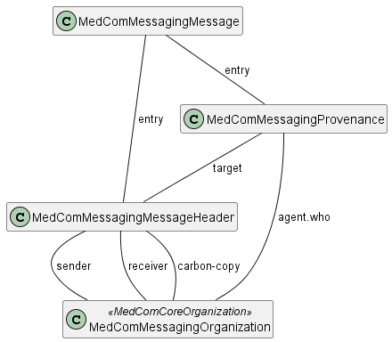

# Introduction to the Technical Content

> In case of discrepancies between the <a href="https://build.fhir.org/ig/medcomdk/dk-medcom-messaging/" target="_blank">MedCom Messaging Implementation Guide (IG)</a>
 and this page, it is the IG which should be followed. Please contact <fhir@medcom.dk> if you find discrepandies.

## Content Overview

The <a href="https://build.fhir.org/ig/medcomdk/dk-medcom-messaging/" target="_blank">MedCom Messaging IG</a> describes currently four FHIR profiles, which can be seen below. 

<table class="tg">
<thead>
  <tr>
    <th class="tg-uaof">Profile</th>
    <th class="tg-uaof">Resource</th>
    <th class="tg-uaof">Describtion</th>
    <th class="tg-uaof">MustSupport elements</th>
  </tr>
</thead>
<tbody>
  <tr>
    <td class="tg-ne9s">MedComMessagingMessage</td>
    <td class="tg-ne9s">Bundle</td>
    <td class="tg-ne9s">Acts as a container for the content of the message. The type of the Bundle shall always be 'message'.</td>
    <td class="tg-ne9s">Message id Timestamp Reference to all included profiles</td>
  </tr>
  <tr>
    <td class="tg-ne9s">MedComMessagingMessageHeader</td>
    <td class="tg-ne9s">MessageHeader</td>
    <td class="tg-ne9s">The header of a message, from this profile is the vital information in a message referenced. This profile shall always be the first referenced profile, when the type of the Bundle is 'message'.</td>
    <td class="tg-ne9s">MessagHeader id Narrative text Type of message Sender Organization Receiver Organization Carbon Copy Receiver of the receipt</td>
  </tr>
  <tr>
    <td class="tg-ne9s">MedComMessagingOrganization</td>
    <td class="tg-ne9s">Organization</td>
    <td class="tg-ne9s">Information usefull to identify a messaging organization</td>
    <td class="tg-ne9s">Identifier (SOR-id) Identifier (EAN/GLN-number) Name</td>
  </tr>
  <tr>
    <td class="tg-ne9s">MedComMessagingProvenance</td>
    <td class="tg-ne9s">Provenance</td>
    <td class="tg-ne9s">Information about the activity of the current message and which organization has triggered the message. Further it describes the history of message activities.</td>
    <td class="tg-ne9s">Targets the MessageHeader Timestamps Activity of the message Sender organization If the message is a response to a previuos message</td>
  </tr>
</tbody>
</table>

## General Messaging Model

The figure below illustrates the general messaging model, which all MedCom FHIR messages will comply to. From the entry element in profile MedComMessagingMessage all included profiles shall be referenced, as illustrated with MedComMessagingMessageHeader and MedComMessagingProvenance. MedComMessagingMessageHeader references the sender, receiver and carbon-copy organizations, which all shall be a MedComMessagingOrganization. Additional content, like an Encounter or a Communication profile in the message, is referenced from the focus element inMedComMessagingMessageHeader.

 